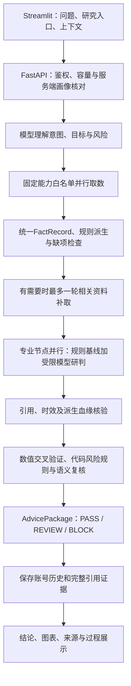

# 图片中15项技术要求：当前代码重新核查与设计说明

核查日期：2026-10-02。图片内容作为待验收要求，勾选符号不作为实现证据。“底部”按底层技术理解，文末也解释回答底部的过程、来源和核验记录。

当前结论：主要业务流程已经实现，但不能宣布15项全部完成。数据接入存在真实上游授权拒绝与评分维度缺项；秒级数据新鲜度、100用户同时获得完整研究、完整回答不超过3秒、长期99.9%可用性尚未全部达标。

本报告依据当前代码、重新执行的419项测试、本次真实模型和数据探针、本次100账号双进程HTTP隔离压测。先前报告只作为带日期的补充证据，不代替本次结果。

## 1. 当前验证结果

| 验证 | 本次结果 | 能证明的范围 |
|---|---|---|
| 全量回归 | 修改前418项通过；修正指标后419项通过，28.95秒 | 覆盖测试中的业务、安全、缓存、会话、历史与前端行为；不等于生产SLA |
| 源码编译及补丁格式 | compileall、git diff --check通过 | Python语法与跟踪文件补丁格式 |
| 真实模型 | 4项检查通过，7次逻辑调用 | 合成输入上的画像抽取、多轮指代、收益保证拦截、两个专业节点及后置审核 |
| 真实模型完整分析 | 4.544秒，超过3秒 | 合成证据上的协调器完整流程；不含真实取数、HTTP鉴权、正式数据库与浏览器 |
| 行情探针 | 上游HTTP 401，3.552秒 | 当前凭据/能力/查询被供应商拒绝授权；不能推断是项目本地登录失败，也不能据此确定具体授权原因 |
| 新闻探针 | 50条规范化事实，35条带链接，3.006秒 | 当前新闻能力可读取；事实条数不等于50篇独立文档 |
| 研报探针 | 50条规范化事实，50条带链接，3.804秒 | 当前研报能力可读取；同一问财聚合商 |
| 100账号同时发起研究 | 本次突发100次：84次PASS、16次HTTP 429；完成研究的P95为3.0466秒 | 两个本机API进程、正常注册/问卷/确认、真实HTTP和账号历史；模型与市场接口为合成响应 |
| 并发记录的证据恢复 | 84个完成结果的引用存在、历史引用完整 | 本次返回研究的账号及引用集合；未完成的16次不能算成功 |
| 当前运行服务 | 8000 API健康/就绪200；8501前端健康200 | 检查时API与Streamlit进程可响应，不能证明所有外部能力可用 |
| 合成演示渲染 | Streamlit AppTest八个场景无异常，报告20个本地链接有效 | 当前结果组件实际渲染；不等于浏览器截图视觉验收 |
| 独立8502演示页 | 检查时未运行 | 不能告诉别人它现在已可打开；可按后文命令启动 |

本次新证据：

- [真实模型探针](D:/tonghuashun/tonghuashun/deliverables/requirements_recheck_llm_20261002.json)
- [真实数据探针](D:/tonghuashun/tonghuashun/deliverables/requirements_recheck_sources_20261002.json)
- [100账号双进程隔离压测](D:/tonghuashun/tonghuashun/deliverables/requirements_recheck_capacity_20261002.json)

今日已有的真实模型与问财压测报告 [research_capacity_20261002.json](D:/tonghuashun/tonghuashun/deliverables/research_capacity_20261002.json) 记录100账号、4轮、402次请求：66次返回研究、336次429，完成研究P95为23.9031秒。本次读取核对了该报告，但没有重新进行100账号真实付费压测。其旧字段 `elapsed_window_seconds: 60` 不足以证明实际持续观测了完整一分钟；当前脚本已经分别记录目标时长和实际负载窗口。该报告同样不能证明生产容量或长期可用性。

## 2. 逐项完成状态、项目体现和实现技术

| 项 | 要求与状态 | 项目中怎样体现 | 技术实现与设计 |
|---|---|---|---|
| 1 | 第三方大模型主题研判：已实现，本次真模型通过 | 市场、行业、个股等回答及专业节点的 `engine=third_party_llm` | `OpenAICompatibleLLM` 用httpx异步请求兼容Chat Completions接口；角色指令、授权事实、规则基线、上下文组成输入，Pydantic校验JSON输出。共享连接池、信号量、总超时和有限重试控制调用。 |
| 2 | 自动市场解读、行业追踪、个股建议：生成机制已实现，真实内容覆盖部分受限 | 五个研究入口输出结论、适配、风险、下一步；资料不足时保留缺项 | 语义服务识别意图及对象；固定能力路由并行取数、标准化、派生评分，再调用对应专业节点。缺项触发最多一轮相关补取，未补齐继续降级。“追踪”是刷新研究和追问，未实现无人值守定时推送。 |
| 3 | 可解释输出与风险提示：机制已实现 | 结论面板、风险、分项引用、把握原因、失效条件、核验记录 | `AgentResult` 将观点与 `facts_used`、`risk_flags`、`confidence_reasons`、`invalidation_conditions`绑定；代码风险规则与语义审核共同形成PASS/REVIEW/BLOCK。规则风险不能被模型删掉。 |
| 4 | 宏观/行业/个股/基金/组合协作：已实现 | 个股研究调用市场、行业、个股；组合诊断最多五个专业节点 | 手写 `CoordinatorAgent` 按意图映射节点。规则提供数值和准入，混合节点补充模型研判。基金核对风险、类型与期限；组合检查集中度并按画像给固定配置区间，未实现最优投资组合求解。 |
| 5 | 交叉验证与一致性：已实现有限检测 | 分歧、同项冲突、待复核状态；执行记录区分规则分和模型分 | 按实体、字段、期间、来源组织事实；规范化单位后检查数值冲突、破损引用、未完成分析及评分分散；语义复核检查意见矛盾。`score`固定为规则分，`model_score`另存；同一聚合商的不同接口不能当独立来源。 |
| 6 | 多任务并发及聚合：已实现 | 并行专业步骤、后置核验、真实节点状态与耗时 | `asyncio.gather`并发取数及专业分析，`wait_for`限制单节点时间；失败节点转为失败或降级结果，其他任务继续。专业节点结束后依次执行事实核验与风险审核，最后聚合而保留分歧。 |
| 7 | 行情、新闻、研报多源接入：代码接入已实现，当前仅部分可用 | 新闻和研报当前可查询、显示来源链接；行情探针401 | `IwencaiSkillHubProvider`暴露16类固定只读能力，负责凭据、字段别名、单位、实体和日期标准化。当前一个聚合商提供多类信息；尚无两个独立供应商自动交叉确认的证明。401需供应商授权配置解决，代码不能开通权限。 |
| 8 | 溯源与幻觉检测：可追溯及有限检测已实现 | 观点→引用事实→派生原始输入→来源/时间/链接，可恢复历史依据 | `FactRecord`保存来源、时点、报告期、质量、单位和血缘；引用ID必须属于本次授权子集，核验器递归验证派生链并剔除无效引用。完整引用和血缘单独存入 `research_evidence`。这些检查不能证明每句自然语言都真实。 |
| 9 | 核心数据秒级延迟：未证明达标 | 可查看能力耗时、资料日期和缓存命中 | 异步取数、连接复用、公开资料缓存、并发调用合并及超时改善读取性能。行情事实60秒有效期属于接受策略；`snapshot_time`通常是抓取时间，未建立交易所产生→接收→展示的时延测量。 |
| 10 | 不少于100人同时咨询：会话机制实现，完整咨询容量未达标 | readiness显示100会话上限；超载返回429和Retry-After | 同机SQLite WAL共享登录/请求租约，多进程一致撤销、过期回收；阻塞数据库工作使用线程池。研究请求每进程默认最多8个，模型默认并发5；Streamlit后台研究池4线程。本次100突发仅84完成，不能把100登录槽位当100即时答案。 |
| 11 | 完整投顾响应≤3秒：未达标 | `timings_ms`、能力/模型耗时、metrics、完整HTTP压测 | 快速/深入模式、输入切片、公开资料缓存、按账号精确输入的短期模型缓存降低重复耗时；两种模式都保留核验。真实模型合成流程4.544秒，已超过3秒；首个进度包不算完整答案。 |
| 12 | 可用性≥99.9%：已有保护措施，长期达标未验证 | health/readiness、故障降级、外部采样工具 | 有限重试、服务故障熔断、节点预算、过载保护、客户端断连取消。核验或合规失败撤下未经完整审核的观点并返回REVIEW。指标仍是进程内观测，未证明多主机容灾及长期端到端99.9%。 |
| 13 | 可视化过程与结论：已实现 | 持仓图、同口径数值图、过程卡、协作表、来源表、PDF | Streamlit组件、Altair交互条形/折线图、pandas整理数据、HTML/CSS阶段卡；图表取实际引用且口径可比的数据。ReportLab导出PDF。配置与情景图表达现有数据，不是收益预测。 |
| 14 | 多轮、追问、上下文记忆：已实现，本次真模型指代通过 | 追问“它的估值”，历史恢复后继续研究；画像或意图不足时追问 | 浏览器会话用 `st.session_state`；请求最多20条上下文，模型使用最近10条；账号历史经SQLAlchemy持久化、按user_id隔离。服务端确认画像版本与有效期，意图不明生成澄清问题。记忆是有界显式上下文。 |
| 15 | 协作及推导过程展示：已实现 | “分析过程与分项依据”展开节点依赖、状态、观点、引用、失效条件 | Pydantic的TaskPlan验证重复ID、悬空依赖和环；协调器回写状态，历史保存节点ID/依赖；前端从真实结果渲染。展示任务与证据解释，不把模型的隐藏内部思维当可审计材料。当前是固定阶段编排，不是通用任意DAG执行引擎。 |

## 3. 一次请求的真实设计

主入口：[analyze_portfolio](D:/tonghuashun/tonghuashun/backend/app/main.py:790)。



这是正常研究路径。收益保证等风险在取数前拦截；入口不匹配、画像未确认、意图不明也不会照常发布个性化建议。若分析后才发现可补取的引用问题或来源冲突，而且尚未使用补取预算，则补取后再运行完整专业分析和审核；不会无限循环。

分层目的：前端负责交互，API核对身份和业务条件，适配器处理供应商差异，规则处理可复算数值，模型处理语言和研判，审核阶段控制发布，数据库保存可回看依据。每层使用明确的数据对象，而不是互相传递未经约束的模型文字。

## 4. 五个专业智能体怎样工作

主要代码：[rule_agents.py](D:/tonghuashun/tonghuashun/backend/app/agents/rule_agents.py:58)、[HybridInvestmentAgent](D:/tonghuashun/tonghuashun/backend/app/agents/llm_agents.py:252)。

- **市场节点**：增长25%、通胀20%、流动性25%、政策15%、风险偏好15%。五维缺一就不生成完整宏观综合分。
- **行业节点**：景气30%、估值20%、资金20%、政策15%、拥挤度15%；同一行业实体五维齐备才生成综合分，不能跨行业凑数。
- **个股节点**：基本面、估值、技术、事件、治理五个不同维度；缺项明确降级，重复同一维度不能提高覆盖率；基本面与技术分差大时提示冲突。
- **基金节点**：先做风险、产品类型和期限适配，再按已有评分/费用/跟踪信息透明比较；真实问卷路径缺适当性材料不放行候选。传统未带问卷版本的旧画像分支不能被描述为与新版门槛完全相同。
- **组合节点**：检查最大持仓权重、权重总和及用户上限；配置区间由风险等级和偏好确定。例如R3权益40%–60%、固收25%–50%、现金及低波动5%–20%，是目标边界，不是三个自动求和到100%的最优权重。

混合节点先运行规则，再把规则结果和授权事实交给模型；模型JSON经结构和引用校验后，规则风险、失效条件及降级状态仍保留。模型返回的数值存为 `model_score`，`score`与`rule_score`保持规则计算值，共识只用规则分；置信度仍是规则/模型给出的判断指标，未经概率校准。

## 5. 如何做到可复算与溯源

主要代码：[FactRecord](D:/tonghuashun/tonghuashun/backend/app/models/schemas.py:161)、[derive_scoring_facts](D:/tonghuashun/tonghuashun/backend/app/services/research.py:501)、[verify_facts](D:/tonghuashun/tonghuashun/backend/app/agents/coordinator.py:834)。

例如一条明确单位的 `change=0.5%`：服务端规范为0.5个百分点，技术代理分为 `clip(50+3×0.5)=51.5`；派生事实保留 `derived_from` 指向原始涨跌幅。无单位的裸数值不参与百分比派生，原值始终保留。其他规则也按同实体和有效原始事实计算，缺输入不填50分。

新增流动性、风险偏好、景气、资金流和拥挤度代理规则位于 [scoring_dimensions.py](D:/tonghuashun/tonghuashun/backend/app/services/scoring_dimensions.py:13)。政策/事件/治理要求完整的显式评估标签与可引用文档，不能把新闻数量或“未找到处罚”直接转换成好评分。结构化标签有来源不等于其解读语义已自动证明正确。上述分数是研究代理规则，不是经过实证验证的收益模型。

引用链检查事实存在、来源标识、质量、时区和有效期，并递归检查派生输入。质量门槛0.4属于接受政策；来源标识和HTTPS链接的格式检查不等于对上游真实性的全面认证。

历史消息只保存最多60条预览，全部被引用事实、冲突事实及派生输入在同一事务存入独立 [research_evidence](D:/tonghuashun/tonghuashun/backend/app/database.py:133) 表。详情按当前账号及消息ID恢复，兼顾列表查询速度和完整证据。旧记录已经丢失的资料不能恢复。

## 6. 缓存、并发与稳定性如何设计

公开资料缓存：[ResearchFactCache](D:/tonghuashun/tonghuashun/backend/app/services/research_cache.py:17)。同机多个API进程共享SQLite WAL存储，取数租约合并同查询调用，迟到的旧写入者不能覆盖新证据；每次读取仍检查字段时效。缓存按供应商授权摘要分区，个人画像、持仓和调用方资料不进入公共缓存。失败与空资料不是有效缓存；401/403另作短期错误抑制。

模型缓存：[ModelResponseCache](D:/tonghuashun/tonghuashun/backend/app/services/model_response_cache.py:8)。仅对已认证账号、模式、完整输入和系统指令摘要精确匹配，默认120秒，最多256项，进程内保存。命中后仍经过结构、引用、规则和合规检查；改变账号或输入就不复用。

会话：[SharedSessionStore](D:/tonghuashun/tonghuashun/backend/app/shared_sessions.py:9) 使用SQLite WAL、事务、登录租约和有期限请求租约；同主机进程共享100会话上限与撤销状态。工作线程仍在各进程内，该方案不等于多机分布式会话系统。

研究准入：[ResearchAdmission](D:/tonghuashun/tonghuashun/backend/app/services/research_admission.py:6) 默认每进程8个活跃研究、1秒排队，超时429且不发起该请求的付费模型调用。模型客户端另有默认5个并发上限。保护措施防止过载，不承诺百用户吞吐。

故障处理：单能力失败保留其他成功资料；补取最多一轮且权限拒绝不盲目重试；专业节点失败局部降级；后置核验或合规失败撤下未审观点。`httpx.AsyncClient`复用连接，`asyncio.timeout/wait_for`约束总预算。HTTP响应时间从发起到完整结果测量，不能用进度提示代替。

本次修正：[ServiceMetrics.record_analysis](D:/tonghuashun/tonghuashun/backend/app/services/monitoring.py:30) 的“三秒内完成数”仅接受PASS/REVIEW/BLOCK；OVERLOADED和ERROR不计入。新增行为回归测试。该计数仍包括澄清或有限分析的REVIEW，不能单独证明“有效研究回答≤3秒”；HTTP总体成功率也不能代替完整业务可用率或长期SLA。

## 7. 页面底部怎样展示、向别人怎样演示

主要代码：[result_views.py](D:/tonghuashun/tonghuashun/frontend/result_views.py:51)、[render_logic_chain](D:/tonghuashun/tonghuashun/frontend/presentation.py:455)、[render_source_trace](D:/tonghuashun/tonghuashun/frontend/presentation.py:542)。

- “分析过程与分项依据”：Streamlit的expander延迟展开；阶段卡用HTML/CSS，协作表读取TaskPlan的依赖及实际状态，分项展开显示观点、引用、风险和失效条件。
- “数据溯源”：读取实际引用及派生父输入，显示业务名称、原值、时间、来源和可用原文链接；不是模型生成一张来源表。
- “资料核验记录”：`answer_visibility.py`将资料缺项和执行诊断整理到核验记录，重大投资风险仍在正文显示；折叠诊断不改变后端审核结果。
- “执行记录”：持仓分析页面显示规则计算分、模型研判分、置信度和差异说明，方便说明评分职责。
- 图表：Altair交互条形/折线图只绘制引用中的同口径数值；pandas整理行，Streamlit负责渲染。回答PDF由ReportLab生成，包含依据与风险。

正式演示使用检查时健康的 [本机页面](http://localhost:8501)：普通账号登录，完成并确认投资偏好；选择市场/行业/个股/基金入口，输入明确对象，展示结论、核验记录、过程与来源；再追问“它的估值呢”，恢复历史继续研究。当前行情401时应展示授权失败/缺项状态，不能将缓存或示例资料称为本次最新行情。

接口演示使用 [API文档](http://localhost:8000/docs)，检查readiness和建议包中的 `task_plan`、`agent_results`、`facts`、`data_acquisition`、`timings_ms`、`model_calls`。readiness的configured表示配置存在，不能保证供应商授权通过。

独立合成演示页检查时未运行，可从项目根目录启动：

```powershell
.\.venv\Scripts\python.exe scripts\verify_requirements.py
.\.venv\Scripts\python.exe -m streamlit run frontend\requirements_demo.py --server.port 8502
```

该页显示报告日期与合成警示，适合演示正常分析、过期证据、数值冲突及收益保证拦截。它使用规则和固定语义夹具，其旧ASGI并发报告不能替代本次双进程HTTP或真实外部压测。展示前应核对重新生成脚本的退出码与结果，不将失败样本隐藏。

## 8. 仍未完成的验收工作

1. 恢复行情及其他被拒能力的供应商授权，重新验证真实研究所需的全部维度；即使能取数，也要检查有无政策、事件和治理等有效评分输入。
2. 秒级新鲜度需要上游原始行情时间、接收时间、展示时间与同步时钟；现有抓取时点无法替代。
3. 100用户完整咨询需要目标部署、浏览器、数据库及供应商配额共同达标；当前线程/会话上限及过载保护均不构成容量完成证明。
4. 完整3秒需要缩短串行意图、取数/补取、专业研判和语义复核路径，并满足实际并发配额；不能靠提前返回或快速拒绝达标。
5. 99.9%需要定义统计窗口与完整咨询可用判据，持续端到端观测及恢复验证；生产多机容灾等仍没有本次完成证据。

本次没有改动供应商凭据、正式账号或用户持仓；保留现有工作区修改。新增报告、独立探针证据和一个指标修正，无提交或推送。
